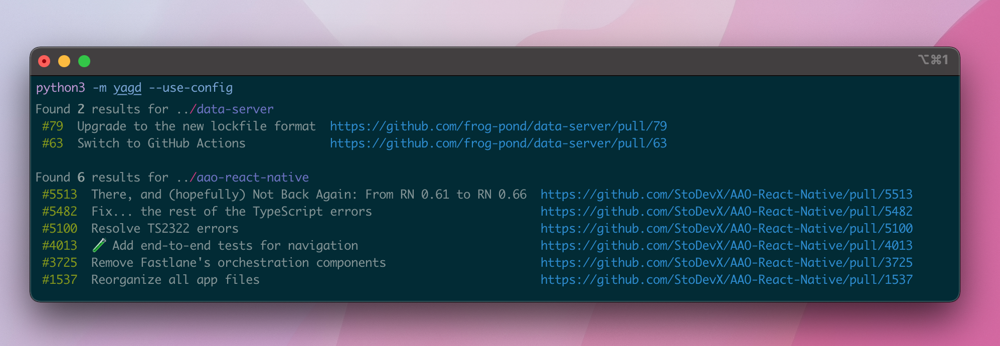

# yagd - yet another github dashboard

Designed for visualizing open pull requests across multiple repositories and usernames.

Backed by the [gh cli] for searching and filtering, and [rich] for displaying results.



---

Requires Python 3.6+.

```shell script
$ python3 -m venv ./venv
$ source ./venv/bin/activate # or activate.csh or activate.fish
$ pip install -r requirements-dev.txt
$ pip install -r requirements.txt
$ python3 -m yagd
```

Other commands:

## CLI

```shell script
$ python3 -m yagd --help
```

<!--- START USAGE -->
```shell script
usage: yagd [-h] [-r REPOS [REPOS ...]] [-rv] [-m] [-u]
            [-a AUTHORS [AUTHORS ...]]
            [-at AUTHORS_FROM_TEAMS [AUTHORS_FROM_TEAMS ...]] [-d] [-hd] [-sb]
            [-sa] [-db] [-c]

Visualize pull requests across multiple repos and users.

optional arguments:
  -h, --help            show this help message and exit
  -r REPOS [REPOS ...], --repos REPOS [REPOS ...]
                        <Required> paths of the repos cloned on your machine
  -rv, --reviewed       include pull requests you already reviewed
  -m, --mine            include pull requests created by you
  -u, --urls            show the pull request url
  -a AUTHORS [AUTHORS ...], --authors AUTHORS [AUTHORS ...]
                        show pull requests by a list of users
  -at AUTHORS_FROM_TEAMS [AUTHORS_FROM_TEAMS ...], --authors-from-teams AUTHORS_FROM_TEAMS [AUTHORS_FROM_TEAMS ...]
                        fetch authors from a list of github teams
  -d, --drafts          only show draft pull requests
  -hd, --headers        show column headers
  -sb, --show-branch    show the pull request branch
  -sa, --show-author    show the pull request author name
  -db, --debug          enables debug logging
  -c, --use-config      use a saved config environment
```
<!--- END USAGE -->

The main CLI entry point; see `--help`.

Basic usage is as follows:

```shell script
# query multiple repositories
$ python3 -m yagd --repos <path1> <path2>

# query a single repo, filtered by a set of authors
$ python3 -m yagd --repos <path> --authors <user1> <user2>

# query from a list of authors from the github api
# note: the usernames of the team member are fetched for you
# given you provide the organization and team ids:
# e.g. github.com/orgs/{org-name}/teams/{team-name}
The config variant is formatted like so in `config.py`:

authors-from-teams: [
  {'org': '<org-name>', 'team': '<team-name>'}
]

# unfilter requests you have previously reviewed
$ python3 -m yagd -repos <path> --reviewed

# unfilter requests that you have authored
# note: -mine is overriden by -authors
$ python3 -m yagd --repos <path> --mine

# limit the scope to only draft requests
$ python3 -m yagd --repos <path> --drafts

# add the pull request url to the results
$ python3 -m yagd --repos <path> --urls

# complex usage
$ python3 -m yagd -r <repo1> <repo2> -rv -m -a <user1> <user2> -d -u

# invoke using a saved config.py
$ python3 -m yagd --use-config
```

## Using with a saved config

In order to use a config file, you must:

1. Rename config.example.py to config.py.
2. Populate the fields you would like to pass.
3. Invoke via `python3 -m yagd --use-config`

A config file follows the following structure:

```py
default = {
    'repos': [''],
    'authors': [''],
    'include_reviewed': False,
    'include_mine': False,
    'show_urls': False,
    'show_drafts': False,
    'show_headers': False
}
```

## Misc. Scripts

```shell script
$ make
```

An overall wrapper for the below two commands
* Type checking and linting invoked with `mypy` via rules that live inside `.mypy.ini`.
* Formatting invoked via `yapf` via rules that live inside `script/format`.
* Updating usage in the README if the help invocation changes via `script/update-usage.py`

```shell script
$ make format
```

Keeping things tidy.

```shell script
$ make lint
```

Keeping things type-checked and linted.

---

You may notice that there are multiple `requirements*.txt` files. They are split apart so that the dependencies install easily.

| filename                  | why                                          |
| ------------------------- | -------------------------------------------- |
| `requirements.txt`        | Common runtime dependencies                  |
| `requirements-dev.txt`    | Development dependencies – mypy, yapf, etc   |

[gh cli]: https://cli.github.com
[rich]: https://github.com/Textualize/rich
